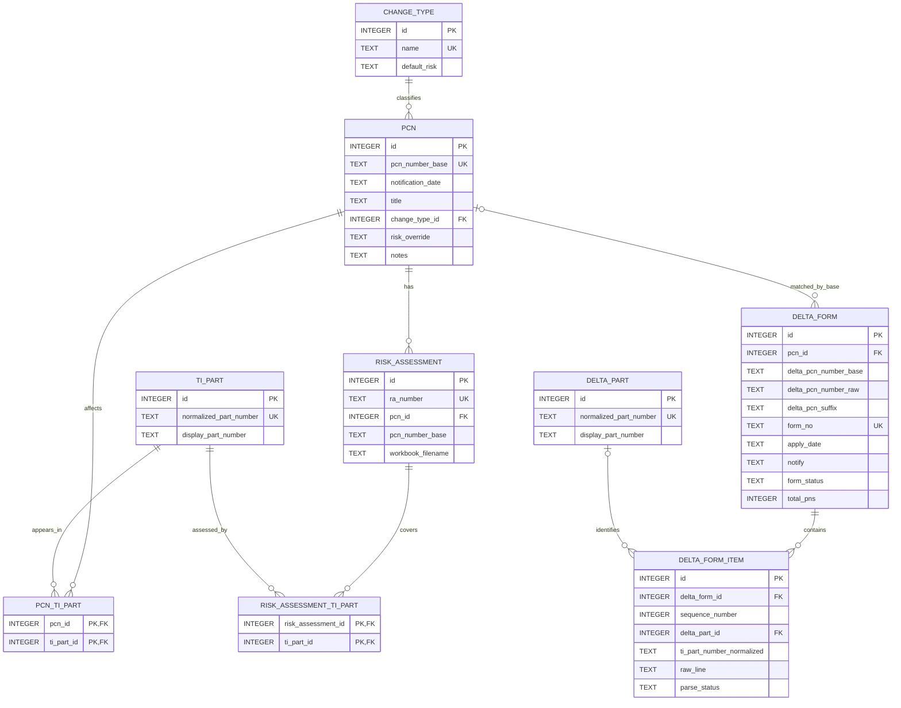
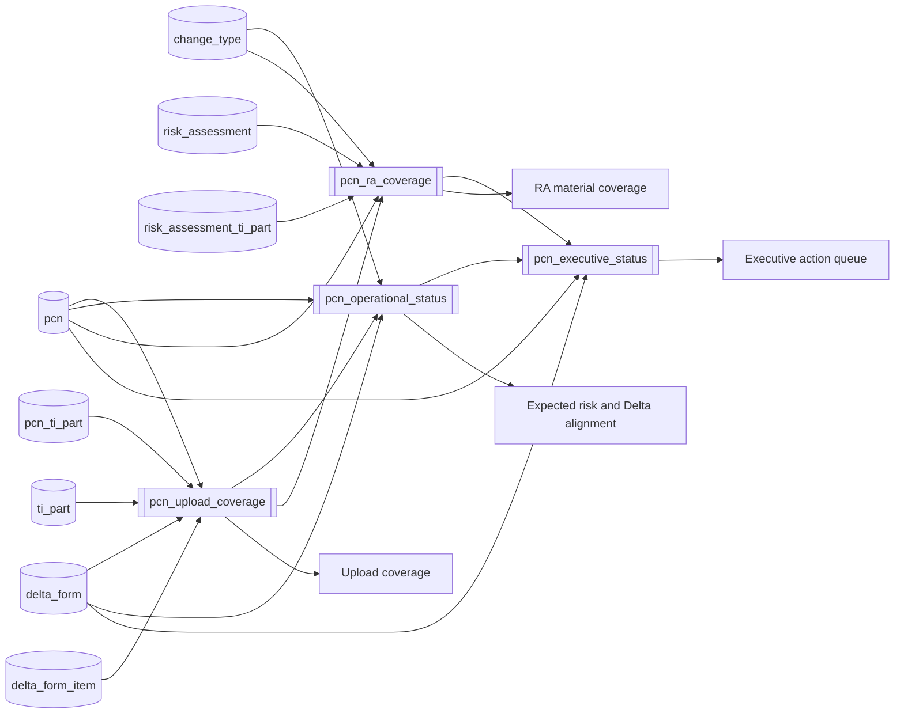

# PCN Workbench

Local PCN tracking application for Windows. The application runs on your own
laptop and stores changes in the included SQLite database. It does not require
a shared server or access to the original Excel files.

## 1. Bring up the application

### Install the prerequisites

Install these once:

1. [Git for Windows](https://git-scm.com/download/win)
2. [Node.js 24 LTS](https://nodejs.org/en/download)

Use the default installation options. Restart Windows after installation if the
commands below are not recognized.

### Download the application

Open **PowerShell**, then run:

```powershell
cd $HOME\Documents
git clone https://github.com/EricLin0123/PCN.git
cd PCN
```

### TI colleagues: connect to VPN and configure the proxy

Before installing packages, make sure the TI company VPN is connected. Then run:

```powershell
npm config set proxy http://webproxy.ext.ti.com:80
npm config set https-proxy http://webproxy.ext.ti.com:80
```

Package installation may fail if the VPN is disconnected or the proxy has not
been configured.

### Install the application packages

Run this once after cloning:

```powershell
npm install
```

No `.env` file or spreadsheet setup is required. The application uses
`data/pcn.db` automatically.

### Start the application

From the `PCN` folder, run:

```powershell
npm run dev
```

Wait until PowerShell displays a local address, normally:

```text
http://localhost:3000
```

Open that address in Edge or Chrome. Keep the PowerShell window open while
using the application. To stop it, return to PowerShell and press **Ctrl+C**.

### Start it again later

Open PowerShell and run:

```powershell
cd $HOME\Documents\PCN
npm run dev
```

Then open [http://localhost:3000](http://localhost:3000).

## 2. Application screenshots

### PCN records


### Overview dashboard


## 3. Data architecture

PCN Workbench uses a normalized SQLite schema with calculated operational views.
The detailed reference is also available in [docs/data-schema.md](docs/data-schema.md).

### Normalized entity relationships



### Calculated operational model



## Back up your data

Each laptop has its own independent database. Changes made by one person do not
appear on another person's laptop.

Stop the application before making a backup. Then run:

```powershell
cd $HOME\Documents\PCN
New-Item -ItemType Directory -Force backups
Copy-Item data\pcn.db "backups\pcn-$(Get-Date -Format yyyyMMdd-HHmmss).db"
```

Keep important backup files somewhere outside the repository as well.

## Optional environment setting

No environment configuration is required. Advanced users can place the database
elsewhere for the current PowerShell session:

```powershell
$env:PCN_DB_PATH = "C:\PCN-Data\pcn.db"
npm run dev
```

The target database must already contain the PCN data. Do not point multiple
computers at the same SQLite file on a network drive.

## Troubleshooting

### `git` is not recognized

Install Git for Windows, close PowerShell, and open it again.

### `npm` or `node` is not recognized

Install Node.js 24 LTS, close PowerShell, and open it again.

### Port 3000 is already in use

Run the application on another port:

```powershell
$env:PORT = "3001"
npm run dev
```

Then open [http://localhost:3001](http://localhost:3001).

### The application was closed accidentally

Your saved changes remain in `data\pcn.db`. Start the application again using
the instructions above.

## Important notes

- SQLite is the only runtime source of truth.
- The application does not import or synchronize Excel/CSV files.
- TI affected parts are read-only.
- Do not delete or replace `data/pcn.db` without keeping a backup.
- Do not run `git pull` after entering new data unless you have first backed up
  `data/pcn.db`; database changes can conflict with repository updates.
