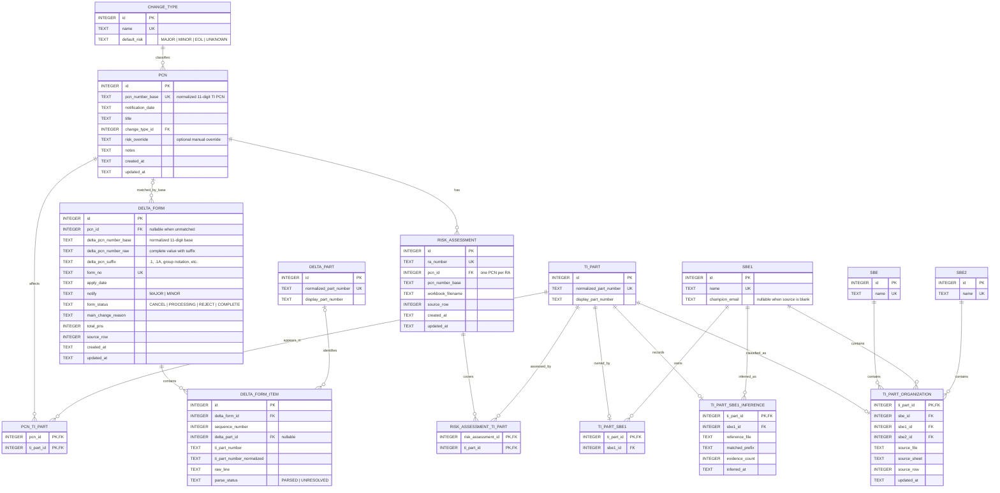
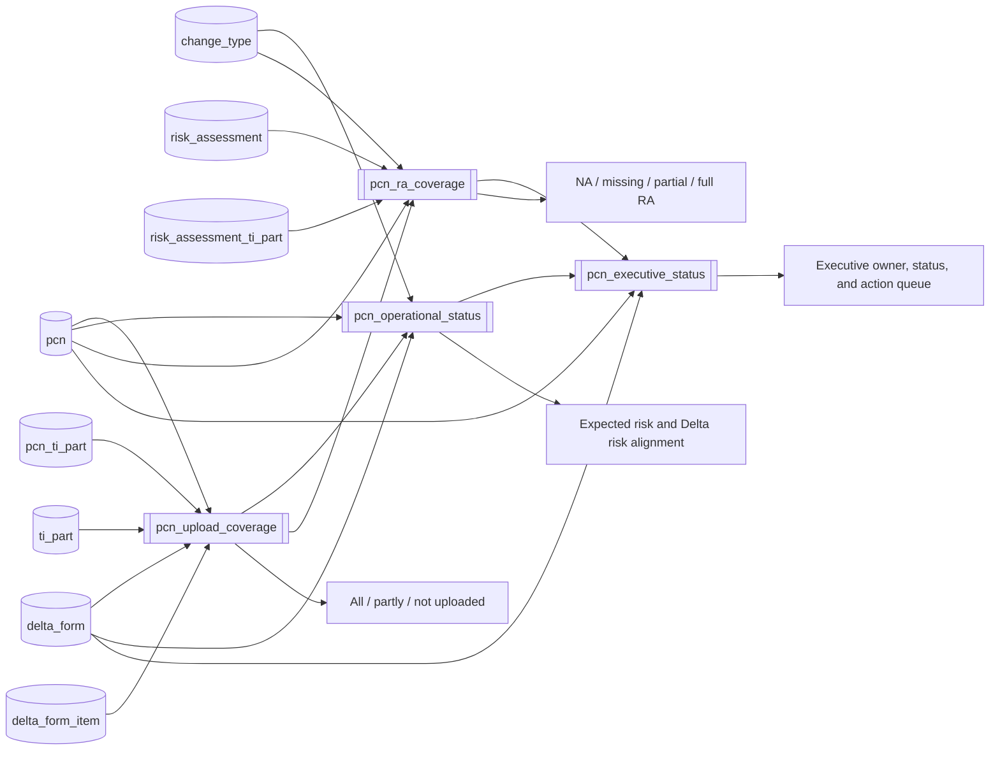

# PCN Workbench data schema

The application uses SQLite as its sole runtime source of truth. Source
spreadsheets are not part of the running system.

## Normalized entity relationships

## Calculated operational model

The dashboard does not store spreadsheet-derived status columns. SQLite views
calculate them from normalized facts whenever the application queries them.

## Important integrity rules

- A normalized TI PCN base is unique and contains exactly 11 digits.
- A PCN can affect many TI parts, and a TI part can appear in many PCNs.
- A TI part belongs to at most one SBE-1; each SBE-1 supplies a champion email
  used to request missing risk assessments. Unknown ownership and blank contact
  data remain null rather than being inferred.
- The BU contact list may be used to infer only missing ownership. An inference
  is accepted when its workbook product-family rule and a non-conflicting
  authoritative part-number prefix agree; existing assignments are preserved.
- A PCN can have many Delta forms while preserving each complete suffixed Delta
  PCN number.
- One risk assessment belongs to at most one PCN; one PCN can have many risk
  assessments.
- A risk assessment can cover multiple authoritative TI parts.
- Database triggers prevent an RA from covering a part outside its PCN and
  prevent removal of a TI relationship while an RA depends on it.
- Executive, upload, RA-coverage, and risk-alignment states are calculated rather
  than copied from Excel.
